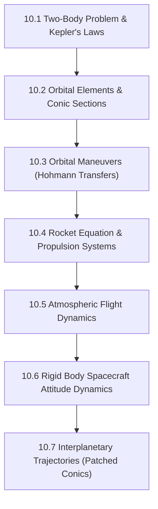

# Subject Syllabus: 10 - Aerospace Engineering & Orbital Mechanics

*Back to [Math & Physics Curriculum](07---Math-and-Physics-Index)*

This syllabus defines the roadmap to mastering aerospace engineering, astrodynamics, propulsion, and orbital mechanics. Follow the **Pearson/Ambrose Textbook Directive** (Definitions, Axioms, Theorems, Lemmas, Proofs) for every topic generated here.

---

## 🗺️ 1. Curriculum Mindmap & Milestones

---

## 📚 2. Premium Free Learning Catalog

*   **🎬 Video Playlists & Courses:**
    *   [MIT OCW - Introduction to Aerospace Engineering (16.00)](https://ocw.mit.edu/courses/16-00-introduction-to-aerospace-engineering-and-design-spring-2003/)
    *   [MIT OCW - Astrodynamics (16.346)](https://ocw.mit.edu/courses/16-346-astrodynamics-fall-2008/) (Advanced orbital mechanics).
*   **📖 Open-Access Textbooks:**
    *   *Orbital Mechanics for Engineering Students* by Howard D. Curtis (Industry standard).

---

## 📝 3. Textbook-Style Proof: The Vis-Viva Equation

**Theorem:** For any body in an elliptical orbit around a central mass $M$, the velocity $v$ at any distance $r$ is given by the Vis-Viva equation:

$$
v^2 = GM \left( \frac{2}{r} - \frac{1}{a} \right)
$$

Where $a$ is the semi-major axis.

🔍 View Rigorous Proof

#### Definition 1: Specific Mechanical Energy
The specific orbital energy $\varepsilon$ (energy per unit mass) is conserved in a two-body system:

$$
\varepsilon = \frac{v^2}{2} - \frac{\mu}{r}
$$

Where $\mu = GM$.

#### Axiom 1: Energy at Apoapsis and Periapsis
At the apsides (periapsis $r_p$ and apoapsis $r_a$), the velocity vector is perpendicular to the position vector, so angular momentum $h = r v$.

#### Lemma 1: Total Energy in terms of Semi-Major Axis
Using conservation of energy and momentum at $r_p$ and $r_a$, and knowing $2a = r_p + r_a$:

$$
\varepsilon = -\frac{\mu}{2a}
$$

#### Proof of Vis-Viva Theorem
Equate the two expressions for specific mechanical energy:

$$
\frac{v^2}{2} - \frac{\mu}{r} = -\frac{\mu}{2a}
$$

Multiply by 2 and isolate $v^2$:

$$
v^2 = \frac{2\mu}{r} - \frac{\mu}{a} = \mu \left( \frac{2}{r} - \frac{1}{a} \right)
$$

Since $\mu = GM$, the theorem is proven:

$$
v^2 = GM \left( \frac{2}{r} - \frac{1}{a} \right)
$$

---

## Related Notes
- [AGENT_MANUAL](AGENT_MANUAL) - Shared mathematics/learning focus
- [SVG_TEMPLATES](SVG_TEMPLATES) - Shared mathematics/learning focus
- [10.1 - Two-Body Problem & Kepler's Laws](10.1---Two-Body-Problem-&-Kepler's-Laws) - Same Aerospace Engineerin folder
- [10.2 - Orbital Elements & Conic Sections](10.2---Orbital-Elements-&-Conic-Sections) - Same Aerospace Engineerin folder
