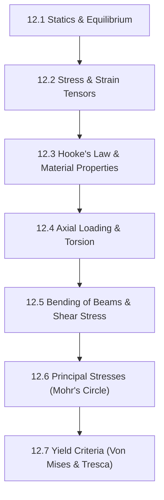

# Subject Syllabus: 12 - Solid Mechanics & Materials Science

*Back to [Math & Physics Curriculum](07---Math-and-Physics-Index)*

This syllabus defines the roadmap to mastering stress-strain tensors, material elasticity, beam theory, torsion, and failure criteria. Follow the **Pearson/Ambrose Textbook Directive** (Definitions, Axioms, Theorems, Lemmas, Proofs) for every topic generated here.

---

## 🗺️ 1. Curriculum Mindmap & Milestones

---

## 📚 2. Premium Free Learning Catalog

*   **🎬 Video Playlists & Courses:**
    *   [StructureFree - Mechanics of Materials](https://www.youtube.com/playlist?list=PL44E9FA04BCEE07C6) (Superb problem-solving walkthroughs).
    *   [MIT OCW - Mechanics of Materials (3.032)](https://ocw.mit.edu/courses/3-032-mechanical-behavior-of-materials-fall-2007/)
*   **📖 Open-Access Textbooks:**
    *   *Mechanics of Materials* by R.C. Hibbeler (Standard reference text).

---

## 📝 3. Textbook-Style Proof: Axial Deformation

**Theorem:** The axial deformation $\delta$ of a uniform rod of length $L$, cross-sectional area $A$, and Young's Modulus $E$ subjected to a constant axial load $P$ is given by:

$$
\delta = \frac{PL}{AE}
$$

🔍 View Rigorous Proof

#### Definition 1: Normal Stress
The average normal stress $\sigma$ acting on a cross-section of area $A$ subjected to internal axial force $P$ is:

$$
\sigma = \frac{P}{A}
$$

#### Definition 2: Normal Strain
The average normal strain $\epsilon$ for a member of original length $L$ changing length by $\delta$ is:

$$
\epsilon = \frac{\delta}{L}
$$

#### Axiom 1: Hooke's Law (Linear Elasticity)
For linearly elastic, isotropic materials undergoing small deformations, stress is directly proportional to strain:

$$
\sigma = E \epsilon
$$

Where $E$ is the Modulus of Elasticity (Young's Modulus).

#### Proof of Deformation
Substitute Definition 1 and Definition 2 into Axiom 1:

$$
\frac{P}{A} = E \left( \frac{\delta}{L} \right)
$$

Isolate $\delta$ by multiplying both sides by $L$:

$$
\frac{PL}{A} = E \delta
$$

Divide by $E$:

$$
\delta = \frac{PL}{AE}
$$

The theorem is proven.

---

## Related Notes
- [AGENT_MANUAL](AGENT_MANUAL) - Shared mathematics/learning focus
- [SVG_TEMPLATES](SVG_TEMPLATES) - Shared mathematics/learning focus
- [12.1 - Statics & Equilibrium](12.1---Statics-&-Equilibrium) - Same Solid Mechanics & Ma folder
- [12.2 - Stress & Strain Tensors](12.2---Stress-&-Strain-Tensors) - Same Solid Mechanics & Ma folder
