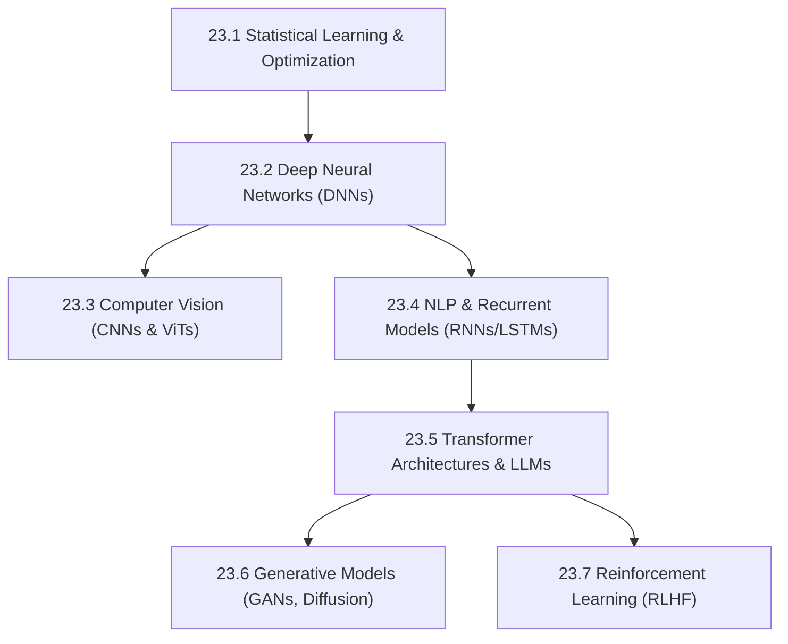

# Subject Syllabus: 23 - AI & Machine Learning Systems

*Back to [Learning Progress](Learning-Progress)*

This syllabus defines the roadmap to mastering modern Artificial Intelligence, focusing on the deep mathematics of backpropagation, Transformer architectures (LLMs), computer vision, and reinforcement learning.

---

## 🗺️ 1. Curriculum Mindmap & Milestones

---

## 📚 2. Core Subjects

### A. The Mathematics of Neural Networks
*   **Calculus & Linear Algebra:** Gradients, Jacobians, Hessians, and matrix operations.
*   **Backpropagation:** The chain rule applied to computation graphs.
*   **Optimization Algorithms:** Gradient Descent, Momentum, RMSprop, Adam.

### B. Transformer Architectures (The LLM Core)
*   **Self-Attention Mechanism:** Understanding $Q, K, V$ (Query, Key, Value) matrices.
*   **Positional Encoding:** Injecting sequence order via sine/cosine waves.
*   **Decoder-Only vs Encoder-Decoder:** GPT vs BERT/T5 architectures.

### C. Generative Models
*   **Diffusion Models:** Forward noise processes and reverse denoising (U-Net architectures).
*   **Variational Autoencoders (VAEs):** Latent space representations.

### D. Agentic AI & Fine-Tuning
*   **RLHF:** Reinforcement Learning from Human Feedback.
*   **LoRA / QLoRA:** Low-Rank Adaptation for efficient fine-tuning.
*   **Agent Workflows:** ReAct prompting, Tool Calling, and multi-agent orchestration.

---

## 📝 3. Textbook-Style Proof: Scaled Dot-Product Attention

When documenting AI mathematics, rely on the **Pearson/Ambrose Textbook Directive**.

**Theorem:** The self-attention mechanism computes the context vector as a weighted sum of values, where the weights are determined by the compatibility of queries and keys scaled by the square root of their dimension $d_k$:

$$
\text{Attention}(Q, K, V) = \text{softmax}\left(\frac{QK^T}{\sqrt{d_k}}\right)V
$$

🔍 View Proof / Derivation Framework

*(This section will be expanded in the NLP module, deriving the necessity of the $\sqrt{d_k}$ scaling factor to prevent the softmax function from entering regions with vanishing gradients when dot products become exceptionally large in high-dimensional spaces.)*

---

## Related Notes
- [23.1 - Statistical Learning & Optimization](23.1---Statistical-Learning-&-Optimization) - Same AI & Machine Learnin folder
- [23.2 - Deep Neural Networks - Backprop & Architecture](23.2---Deep-Neural-Networks---Backprop-&-Architecture) - Same AI & Machine Learnin folder
- [23.3 - Computer Vision - CNNs & ViTs](23.3---Computer-Vision---CNNs-&-ViTs) - Same AI & Machine Learnin folder
- [23.4 - NLP & Recurrent Models - RNNs & LSTMs](23.4---NLP-&-Recurrent-Models---RNNs-&-LSTMs) - Same AI & Machine Learnin folder
- [23.5 - Transformer Architectures & LLMs](23.5---Transformer-Architectures-&-LLMs) - Same AI & Machine Learnin folder
