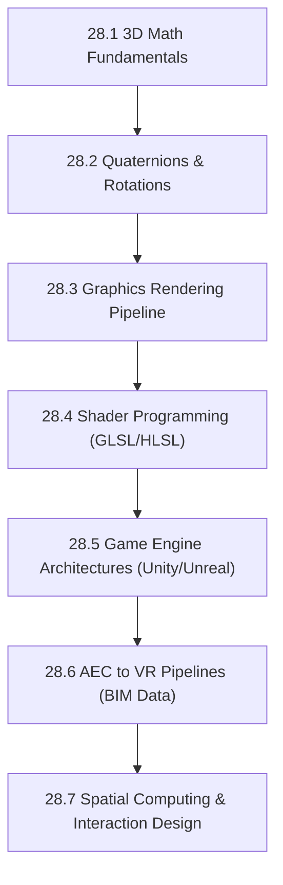

# Subject Syllabus: 28 - VR & 3D Engineering

*Back to [Learning Progress](Learning-Progress)*

This syllabus maps the transition from AEC/3D Modeling expertise into deep Spatial Computing and VR Engineering. It focuses heavily on the underlying 3D mathematics, graphics rendering pipelines, and game engine architectures.

---

## 🗺️ 1. Curriculum Mindmap & Milestones

---

## 📚 2. Core Subjects

### A. 3D Math & Quaternions
*   **Linear Algebra for 3D:** Translation, Rotation, and Scaling matrices (TRS).
*   **Coordinate Spaces:** Object Space $\to$ World Space $\to$ Camera/View Space $\to$ Clip/Screen Space.
*   **Quaternions:** Why we use them (avoiding Gimbal Lock), Slerp (Spherical Linear Interpolation), and quaternion multiplication.

### B. The Graphics Pipeline & Shaders
*   **The Pipeline:** Vertex Shader $\to$ Rasterization $\to$ Fragment/Pixel Shader.
*   **Shading Models:** Lambertian reflectance, Phong, PBR (Physically Based Rendering).
*   **Compute Shaders:** Utilizing the GPU for non-rendering calculations (e.g., fluid simulations, particle systems).

### C. Engine Architectures
*   **Unity (C#):** MonoBehaviour lifecycle, ScriptableObjects, Data-Oriented Technology Stack (DOTS) / ECS.
*   **Unreal (C++):** UObject hierarchy, Actor lifecycles, Blueprints vs C++, Lumen/Nanite concepts.

### D. AEC to VR Pipelines
*   **Data Translation:** Moving from CAD/BIM (Revit, Rhino) to real-time engines.
*   **Optimization:** Mesh decimation, draw call reduction, baking lighting for VR performance (targeting 90+ FPS).
*   **Metadata Integration:** Retaining BIM properties inside the VR environment.

---

## 📝 3. Textbook-Style Proof: Quaternion Rotation

When documenting 3D math, rely on the **Pearson/Ambrose Textbook Directive**.

**Theorem:** A 3D vector $\mathbf{v}$ can be rotated by an angle $\theta$ around a unit axis $\mathbf{u}$ using the quaternion operation:

$$
\mathbf{v}' = q \mathbf{v} q^{-1}
$$

Where $q = \cos(\theta/2) + \mathbf{u}\sin(\theta/2)$.

🔍 View Proof Framework

*(This section will be expanded in the dedicated Quaternion module, outlining the definition of Hamilton's numbers, the non-commutativity of rotation, and the derivation of the half-angle formula from Euler's axis-angle representation.)*

---

## Related Notes
- [28.1 - 3D Math Fundamentals](28.1---3D-Math-Fundamentals) - Same VR & 3D Engineering folder
- [28.2 - Quaternions & Rotations](28.2---Quaternions-&-Rotations) - Same VR & 3D Engineering folder
- [28.3 - Graphics Rendering Pipeline](28.3---Graphics-Rendering-Pipeline) - Same VR & 3D Engineering folder
- [28.4 - Shader Programming - GLSL & HLSL](28.4---Shader-Programming---GLSL-&-HLSL) - Same VR & 3D Engineering folder
- [28.5 - Game Engine Architectures - Unity & Unreal](28.5---Game-Engine-Architectures---Unity-&-Unreal) - Same VR & 3D Engineering folder
