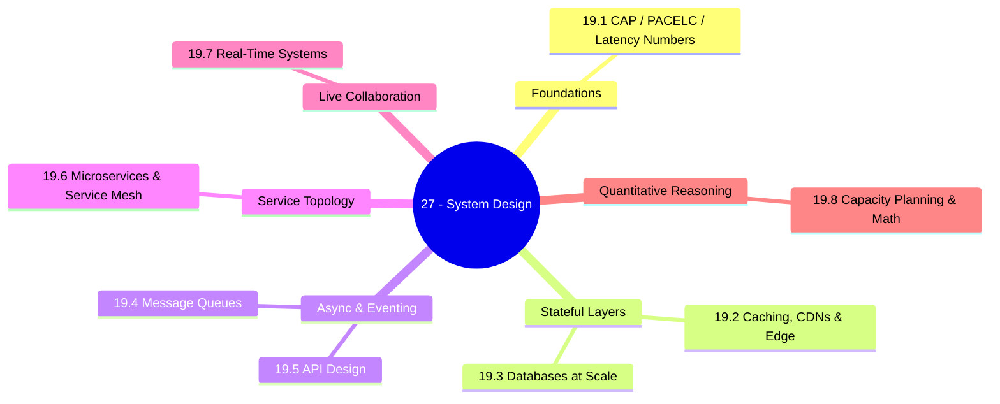
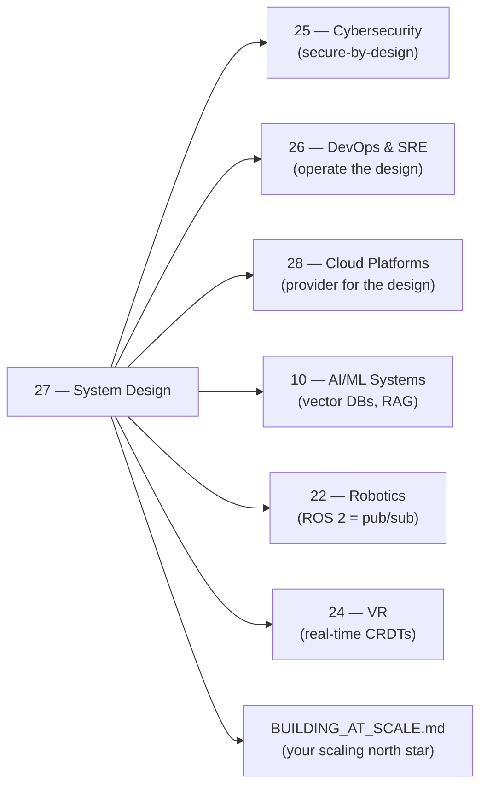

*Back to [00 - 09 - Learning Index](00---09---Learning-Index) | Part of [LEARNING_PATH](LEARNING_PATH)*

# 🏗️ System Design & Distributed Architecture — Subject Plan

> *"The first rule of distributed systems is: don't distribute your system."* — Martin Fowler (paraphrased)

> *"You can have it correct, available, or fast under partition. Pick two — and the network will eventually pick partition for you."*

---

## 🎯 Mission Statement

**Design systems that don't fall over.** CAP theorem reality + caching + databases at scale + message queues + API design + microservices truth + real-time + capacity planning. The track that directly answers **"how do I scale"** from [BUILDING_AT_SCALE](BUILDING_AT_SCALE).

This is the architectural backbone for everything you ship. Where [Track 26](Subject_Plan) keeps systems running and [Track 25](Subject_Plan) keeps them safe, **Track 19 is where you decide what to build in the first place** — what data goes where, how services talk, where state lives, and what the system does when (not if) something breaks.

The chapters mirror the questions a senior engineer is asked at architecture review:
- *Will it stay correct under partition?* → 19.1 CAP & PACELC
- *Where does the heat go?* → 19.2 Caching, CDNs & Edge
- *How does data scale past one box?* → 19.3 Databases at Scale
- *How do services talk without coupling?* → 19.4 Message Queues & Event-Driven
- *What is the contract?* → 19.5 API Design
- *Should this even be a microservice?* → 19.6 Microservices & Service Mesh
- *Can two users edit the same thing live?* → 19.7 Real-Time Systems
- *Will it survive Tuesday's traffic spike?* → 19.8 Capacity Planning

---

## 📊 Track Overview



---

## 📚 Chapter Inventory

| # | Chapter | Domain | Status |
|---|---------|--------|--------|
| 19.1 | System Design Fundamentals | CAP, PACELC, consistency, latency numbers | 🟡 Skeleton |
| 19.2 | Caching, CDNs & Edge | Redis, Memcached, Cloudflare/Fastly, edge compute | 🟡 Skeleton |
| 19.3 | Databases at Scale | Replicas, sharding, NewSQL, vector DBs, time-series | 🟡 Skeleton |
| 19.4 | Message Queues & Event-Driven Architecture | Kafka, NATS, RabbitMQ, CQRS, Saga, outbox | 🟡 Skeleton |
| 19.5 | API Design | REST, GraphQL Federation, gRPC, OpenAPI, AsyncAPI, gateways | 🟡 Skeleton |
| 19.6 | Microservices & Service Mesh | When to decompose, modular monolith, Istio, Linkerd | 🟡 Skeleton |
| 19.7 | Real-Time Systems | WebSockets, WebRTC, SSE, CRDTs, multiplayer patterns | 🟡 Skeleton |
| 19.8 | Capacity Planning & Back-of-Envelope Math | k6, queueing theory, percentiles, USL | 🟡 Skeleton |

---

## 🔗 Prerequisites

| Prerequisite | Where you learned it | Why it matters |
|---|---|---|
| Concurrency model | [1.4 - Concurrency - asyncio, threading, multiprocessing & the GIL](1.4---Concurrency---asyncio,-threading,-multiprocessing-&-the-GIL) | Async, threads, processes are the building blocks of every server |
| Operating systems essentials | [1.10 - Operating Systems Essentials](1.10---Operating-Systems-Essentials) | Schedulers, file systems, virtual memory shape every latency number |
| Computer networks | [1.11 - Computer Networks Essentials](1.11---Computer-Networks-Essentials) | TCP, TLS, HTTP, BGP — what the "wire" actually is |
| Distributed systems & multi-GPU | [1.16 - Distributed Systems & Multi-GPU Training](1.16---Distributed-Systems-&-Multi-GPU-Training) | Parameter servers, AllReduce — distributed primitives |
| SQL & relational fundamentals | [Subject_Plan](Subject_Plan) | Indexing, transactions, isolation levels |
| Working knowledge of one language | Python, Go, or TypeScript at production-fluency | All examples in those three |

---

## 🆓 Open-Source / Free Catalog

> Pictures, videos, and reference materials live **outside the repo** (YouTube, official docs, open-source books). Each chapter and the [README](README) hub link to them by URL. SVG diagrams that we author live inside `_svgs/` with the `sysdes__<ch>-fig<n>.svg` prefix.

### 📖 Books (free chapters / fully open)

| Title | Author / Provider | Why |
|---|---|---|
| **Designing Data-Intensive Applications** | Martin Kleppmann (O'Reilly) — many chapter previews online | The single best modern systems book |
| **The Twelve-Factor App** | Adam Wiggins / Heroku | The default contract for cloud-native apps — [12factor.net](https://12factor.net/) |
| **System Design Primer** | Donne Martin (CC-BY-SA 4.0) | The most-starred system-design GitHub — [github.com/donnemartin/system-design-primer](https://github.com/donnemartin/system-design-primer) |
| **Microservices.io patterns** | Chris Richardson | Canonical pattern catalog — [microservices.io/patterns](https://microservices.io/patterns/) |
| **Awesome Distributed Systems** | theanalyst | Curated reading list — [github.com/theanalyst/awesome-distributed-systems](https://github.com/theanalyst/awesome-distributed-systems) |
| **DDIA References** | Martin Kleppmann | Per-chapter primary-source bibliography — [github.com/ept/ddia-references](https://github.com/ept/ddia-references) |
| **Latency Numbers Every Programmer Should Know** | Jeff Dean / jboner gist | The Rosetta Stone of "how slow is X" — [gist.github.com/jboner/2841832](https://gist.github.com/jboner/2841832) |
| **High Scalability** | Todd Hoff | Decade-deep architecture case studies — [highscalability.com](http://highscalability.com/) |
| **Netflix Tech Blog** | Netflix Engineering | The canonical post-mortem case-study source — [netflixtechblog.com](https://netflixtechblog.com/) |
| **Discord Engineering Blog** | Discord Engineering | Real-time at scale — [discord.com/category/engineering](https://discord.com/category/engineering) |
| **Stripe Engineering** | Stripe Engineering | API design at scale — [stripe.com/blog/engineering](https://stripe.com/blog/engineering) |
| **AWS Architecture Center** | AWS | Reference architectures, well-architected framework — [aws.amazon.com/architecture](https://aws.amazon.com/architecture/) |

### 🎓 Courses & Lecture Series

| Resource | Provider | Coverage |
|---|---|---|
| **MIT 6.824 — Distributed Systems** | MIT (Robert Morris) | Free lectures + Raft labs — [pdos.csail.mit.edu/6.824](https://pdos.csail.mit.edu/6.824/) |
| **CMU 15-445 / 15-721 — Database Systems** | Andy Pavlo | The best-explained database internals course online — [15445.courses.cs.cmu.edu](https://15445.courses.cs.cmu.edu/) |
| **DesignGurus System Design Interview** | DesignGurus | Pattern-first interview prep — [designgurus.io](https://designgurus.io/) |
| **ByteByteGo Newsletter & Channel** | Alex Xu | Visual explainers; complements the books |
| **Educative — Grokking the System Design Interview** | Educative | Industry-standard interview prep |

### 🛠️ Reference Documentation (cite-quality)

| Spec / Tool | Link |
|---|---|
| Apache Kafka docs | [kafka.apache.org/documentation](https://kafka.apache.org/documentation/) |
| NATS / JetStream docs | [docs.nats.io](https://docs.nats.io/) |
| RabbitMQ docs | [rabbitmq.com/documentation.html](https://www.rabbitmq.com/documentation.html) |
| Redis docs | [redis.io/docs](https://redis.io/docs/) |
| pgvector | [github.com/pgvector/pgvector](https://github.com/pgvector/pgvector) |
| CockroachDB docs | [cockroachlabs.com/docs](https://www.cockroachlabs.com/docs/) |
| YugabyteDB docs | [docs.yugabyte.com](https://docs.yugabyte.com/) |
| TiDB docs | [docs.pingcap.com](https://docs.pingcap.com/) |
| OpenAPI 3.1 | [openapis.org](https://www.openapis.org/) |
| AsyncAPI | [asyncapi.com](https://www.asyncapi.com/) |
| Buf (gRPC + protobuf tooling) | [buf.build](https://buf.build/) |
| Yjs (CRDT) | [docs.yjs.dev](https://docs.yjs.dev/) |
| Automerge | [github.com/automerge/automerge](https://github.com/automerge/automerge) |
| ElectricSQL | [electric-sql.com](https://electric-sql.com/) |
| k6 (load testing) | [k6.io/docs](https://k6.io/docs/) |
| Apache JMeter | [jmeter.apache.org](https://jmeter.apache.org/) |
| Gatling | [gatling.io](https://gatling.io/) |

---

## 🏗️ Study Strategy

### Phase 1 — Foundations & Latency Literacy (Chapters 27.1–19.2) — 2 weeks
Internalize CAP, PACELC, and the latency table. Then learn the **cheapest scaling lever in the world**: the cache. Most "scaling problems" are caching problems in disguise.

### Phase 2 — Stateful Scale (Chapters 27.3–19.4) — 3 weeks
Stateful systems are the hard ones. Replication, sharding, NewSQL, message brokers, event sourcing, idempotency. By the end of this phase you can explain *why a Kafka topic is not a queue and why you keep getting that wrong*.

### Phase 3 — Service Topology & Real-Time (Chapters 27.5–19.7) — 3 weeks
APIs, the microservices honest-truth chapter, and the real-time stack. The decision rule that should be tattooed on the wall: **modular monolith first; decompose only when failure domains demand it**.

### Phase 4 — Quantitative Reasoning (Chapter 19.8) — 1 week
Capacity planning. Little's Law. p99 vs p999. The Universal Scalability Law (USL). This is the chapter that makes you the only person in the room who can do napkin math during an incident.

**Total ≈ 9 weeks at 8 hrs/week ≈ 72 hours.**

---

## 🔭 2026 Industry Snapshot (web-grounded)

> Sources rephrased and paraphrased for compliance — never more than 30 consecutive words from any single source.

- **Kafka 4.0 (Jan 2026)** removed ZooKeeper from the distribution; **KRaft is now the only consensus mode**. **RabbitMQ 4.1 (Feb 2026)** doubled down on native streams and quorum-queue performance. — paraphrased from [tech-insider.org — Kafka vs RabbitMQ 2026](https://tech-insider.org/kafka-vs-rabbitmq-2026/) and [tech-insider.org — RabbitMQ vs Kafka 2026](https://tech-insider.org/rabbitmq-vs-kafka-2026/).
- **NATS JetStream** ships everything in a single ~20 MB binary, in contrast to Kafka's JVM fleet. — paraphrased from [synadia.com — Beyond Streaming](https://www.synadia.com/resources/beyond-streaming).
- **Vector DB landscape**: Pinecone (managed leader), Qdrant (Rust speed leader), Weaviate (hybrid + GraphQL), Milvus (large scale), Chroma (DX), pgvector (Postgres default). — paraphrased from [digitalapplied — Vector DBs 2026](https://www.digitalapplied.com/blog/vector-databases-for-ai-agents-pinecone-qdrant-2026) and [jusdb — pgvector vs Pinecone vs Weaviate](https://www.jusdb.com/blog/vector-databases-comparison-pgvector-pinecone-weaviate).
- **API split**: REST is still the default for ~80% of business APIs; GraphQL Federation wins for cross-team graphs; gRPC dominates internal microservices. — paraphrased from [optimum-web — API 2026](https://www.optimum-web.com/blog/api-development-services-2026-rest-graphql-grpc-guide) and [wundergraph — Six-year GraphQL recap](https://wundergraph.com/blog/six-year-graphql-recap).
- **Service mesh**: Istio's **Ambient Mesh** (sidecarless data plane) is the headline 2026 feature; Linkerd remains the simplicity champion. — paraphrased from [tasrieit — Istio vs Linkerd 2026](https://www.tasrieit.com/blog/istio-vs-linkerd-service-mesh-comparison-2026).
- **CRDTs are mainstream**: Yjs is the dominant toolkit, Hocuspocus its websocket backend, and AI agents are now joining as CRDT peers. — paraphrased from [electric-sql — AI agents as CRDT peers](https://electric-sql.com/blog/2026/04/08/ai-agents-as-crdt-peers-with-yjs).
- **Distributed SQL**: CockroachDB (Postgres-first multi-region locality) vs YugabyteDB (lower CPU overhead, Postgres-compatible) vs TiDB (MySQL-first, HTAP via TiKV+TiFlash) vs Spanner (GCP-only, TrueTime). — paraphrased from [jusdb — CockroachDB vs Spanner vs YugabyteDB](https://www.jusdb.com/blog/cockroachdb-vs-spanner-vs-yugabytedb-newsql) and [pingcap — CockroachDB vs TiDB](https://pingcap.com/compare/cockroachdb-vs-tidb).

---

## 📁 Directory Structure

```
19 - System Design & Distributed Architecture/
├── Subject_Plan.md          ← You are here
├── LEARNING_PATH.md         ← Visual roadmap
├── README.md                ← Subject hub + media references
├── 19.1 - System Design Fundamentals.md
├── 19.2 - Caching, CDNs & Edge.md
├── 19.3 - Databases at Scale.md
├── 19.4 - Message Queues & Event-Driven Architecture.md
├── 19.5 - API Design.md
├── 19.6 - Microservices & Service Mesh.md
├── 19.7 - Real-Time Systems.md
└── 19.8 - Capacity Planning & Back-of-Envelope Math.md
```

SVG figures live one level up in `../_svgs/sysdes__<chapter>-fig<n>.svg`.

---

## 🔗 How This Track Plugs Into Everything Else



---

*Next: [LEARNING_PATH](LEARNING_PATH) — Visual progression map*

---

## Related Notes
- [19.1 - System Design Fundamentals](19.1---System-Design-Fundamentals) - Shared distributed-systems/system-design focus
- [19.2 - Caching, CDNs & Edge](19.2---Caching,-CDNs-&-Edge) - Shared system-design/caching focus
- [19.3 - Databases at Scale](19.3---Databases-at-Scale) - Shared system-design/sharding focus
- [19.4 - Message Queues & Event-Driven Architecture](19.4---Message-Queues-&-Event-Driven-Architecture) - Shared message-queues/system-design focus
