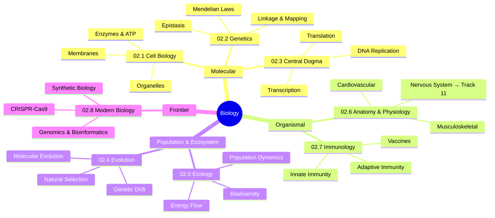

*Back to [09 - Learning Index](09---Learning-Index)*

# Track 02 — Biology: Subject Plan

> *"Nothing in biology makes sense except in the light of evolution."*
> — **Theodosius Dobzhansky** (1973)

---

## 🎯 Mission

Rebuild biology from the ground up at **MIT 7.012 / 7.013 / 7.014 freshman-level rigor** — connecting every concept to three personal pillars:

1. **AI/ML Inspiration** — Neural nets, genetic algorithms, immune-system adversarial defense, protein folding as optimization
2. **Game Dev & Procedural Generation** — Ecosystem simulation, L-systems, evolutionary dynamics, population models
3. **Athlete Health & Biomechanics** — Muscle physiology, nutrition biochemistry, injury recovery, immune function under training load

---

## 📊 Chapter Overview

| # | Chapter | Core Topics | Math Models | AI Connection |
|:---:|:---|:---|:---|:---|
| 02.1 | Cell Biology & Molecular Foundations | Organelles, membranes, ATP, enzymes | Michaelis-Menten kinetics | Compartmentalized computation |
| 02.2 | Genetics & Inheritance | Mendelian genetics, linkage, epistasis | Probability, Bayesian pedigree analysis | Feature inheritance in GANs |
| 02.3 | DNA, RNA & Protein Synthesis | Central dogma, transcription, translation | Information theory (Shannon) | Sequence-to-sequence models |
| 02.4 | Evolution & Natural Selection | Population genetics, molecular evolution | Hardy-Weinberg, Lotka-Volterra, dN/dS | Genetic algorithms, evolutionary strategies |
| 02.5 | Ecology & Ecosystems | Trophic levels, energy flow, biodiversity | Lotka-Volterra, island biogeography | Agent-based ecosystem simulation |
| 02.6 | Anatomy & Physiology Overview | Organ systems, muscle, cardiovascular | Fick's law, Hill equation | Biomechanical modeling |
| 02.7 | Immunology & Disease | Innate/adaptive immunity, vaccines | Clonal selection dynamics | Adversarial ML, anomaly detection |
| 02.8 | Modern Biology | CRISPR, genomics, synthetic biology | Sequence alignment scoring | ML for protein design |

---

## 🗺️ Concept Map



---

## 🔗 Cross-Track Dependencies

| Prerequisite | Used In |
|:---|:---|
| [05.2 - Action Potentials & Ion Channels](05.2---Action-Potentials-&-Ion-Channels) | 02.1 (membrane biology), 02.6 (nerve-muscle) |
| [05.6 - Neuromodulators - Dopamine, Serotonin, Acetylcholine](05.6---Neuromodulators---Dopamine,-Serotonin,-Acetylcholine) | 02.3 (neurotransmitter synthesis), 02.6 (autonomic NS) |
| Track 13 — Biomechanics | 02.6 (musculoskeletal physiology) |
| Track 07 — Math (ODEs, probability) | 02.4 (Hardy-Weinberg), 02.5 (Lotka-Volterra) |
| Future Track 16 — Chemistry | 02.1 (biochemistry), 02.3 (organic chem of nucleotides) |

---

## 📚 Core Resources (Free / Open Access)

| Resource | Type | Coverage |
|:---|:---|:---|
| [MIT 7.012 OCW](https://ocw.mit.edu/courses/7-012-introduction-to-biology-fall-2004/) | Full course | Introductory Biology (Lander, Weinberg) |
| [MIT 7.013 OCW](https://ocw.mit.edu/courses/7-013-introductory-biology-spring-2018/) | Full course | Introductory Biology (focus: genetics) |
| [MIT 7.014 OCW](https://ocw.mit.edu/courses/7-014-introductory-biology-spring-2005/) | Full course | Introductory Biology (focus: ecology) |
| [Khan Academy Biology](https://www.khanacademy.org/science/biology) | Video + practice | All topics, excellent visuals |
| [Bozeman Science](https://www.bozemanscience.com/biology) | Video series | AP/College Bio, concise |
| [NIH iBiology](https://www.ibiology.org/) | Research lectures | Cutting-edge topics |
| [Crash Course Biology](https://www.youtube.com/playlist?list=PL3EED4C1D684D3ADF) | Video series | Engaging overview |
| Campbell's Biology (14th ed.) | Textbook | Gold standard reference |
| Molecular Biology of the Cell (Alberts) | Textbook | Molecular depth |
| Genetics: From Genes to Genomes (Hartwell) | Textbook | Genetics focus |

---

## 🏗️ Build Status

| Chapter | Status | Size Target |
|:---|:---|:---|
| 02.1 - Cell Biology & Molecular Foundations | ✅ Complete | 30–50 KB |
| 02.2 - Genetics & Inheritance | ✅ Complete | 35–55 KB |
| 02.3 - DNA, RNA & Protein Synthesis | ✅ Complete | 40–60 KB |
| 02.4 - Evolution & Natural Selection | ✅ Complete | 40–60 KB |
| 02.5 - Ecology & Ecosystems | ✅ Complete | 35–50 KB |
| 02.6 - Anatomy & Physiology Overview | ✅ Complete | 35–55 KB |
| 02.7 - Immunology & Disease | ✅ Complete | 40–60 KB |
| 02.8 - Modern Biology | ✅ Complete | 40–60 KB |
| _practice/scripts/ | ✅ Complete | — |

---

## 🎓 Suggested Study Order

```
02.1 (Cell) → 02.3 (DNA/RNA) → 02.2 (Genetics) → 02.4 (Evolution)
                                                         ↓
                                              02.5 (Ecology) → 02.8 (Modern Bio)
                                                         ↓
                                              02.6 (Anatomy) → 02.7 (Immunology)
```

**Rationale:** Cell biology provides the molecular vocabulary. Central dogma (02.3) before genetics (02.2) because understanding DNA→RNA→Protein makes inheritance mechanisms concrete. Evolution (02.4) unifies everything. Ecology and modern bio branch from evolution. Anatomy and immunology are semi-independent but benefit from all prior chapters.

---

## ⏱️ Time Estimate

| Phase | Hours | Notes |
|:---|:---:|:---|
| 15.1–02.3 (Molecular) | 15–20 | Dense biochemistry, many pathways |
| 15.4–02.5 (Population) | 10–15 | Math-heavy, good for coding practice |
| 15.6–02.7 (Organismal) | 12–18 | Broad coverage, health connections |
| 02.8 (Frontier) | 8–12 | Cutting-edge, fast-moving field |
| Practice scripts | Ongoing | Run weekly for spaced repetition |
| **Total** | **45–65** | ~6–8 weeks at 8–10 hrs/week |

---

## Related Notes
- [02.1 - Cell Biology & Molecular Foundations](02.1---Cell-Biology-&-Molecular-Foundations) - Shared cell-biology/biology focus
- [02.2 - Genetics & Inheritance](02.2---Genetics-&-Inheritance) - Shared genetics/biology focus
- [02.4 - Evolution & Natural Selection](02.4---Evolution-&-Natural-Selection) - Shared evolution/biology focus
- [02.5 - Ecology & Ecosystems](02.5---Ecology-&-Ecosystems) - Shared biology/ecology focus
- [02.7 - Immunology & Disease](02.7---Immunology-&-Disease) - Shared immunology/biology focus
