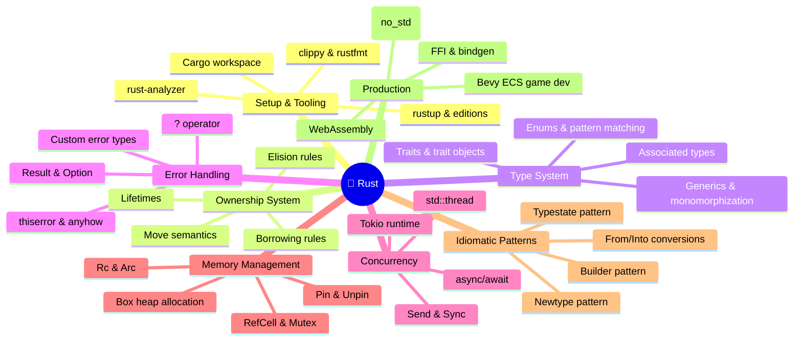

*Back to [Subject_Plan](Subject_Plan) | Part of [09 - Learning Index](09---Learning-Index)*

# 🦀 Track 11 — Rust: Subject Plan

> *"Rust is not a language for people who want to write code quickly. It's a language for people who want to write code that works."* — Graydon Hoare (creator of Rust)

---

## 🎯 Mission Statement

Build production-grade competence in Rust — the language that eliminates data races at compile time, runs at C++ speed, and compiles to WebAssembly, embedded targets, and game engines. This track targets your specific goals: **LLM inference engines**, **Bevy game dev**, and **high-performance CLI/server tools**.

---

## 📊 Curriculum Mindmap

---

## 📚 Chapter Index

| # | Chapter | Core Concept | Status |
|---|---------|-------------|--------|
| 11.1 | [11.1 - Setup, Cargo & Project Structure](11.1---Setup,-Cargo-&-Project-Structure) | Toolchain, editions, workspace layout | 🟡 |
| 11.2 | [11.2 - Ownership, Borrowing & Lifetimes](11.2---Ownership,-Borrowing-&-Lifetimes) | The revolutionary memory model | 🟡 |
| 11.3 | [11.3 - Type System - Enums, Traits & Generics](11.3---Type-System---Enums,-Traits-&-Generics) | Algebraic types + zero-cost polymorphism | 🟡 |
| 11.4 | [11.4 - Error Handling - Result, Option, ? Operator](11.4---Error-Handling---Result,-Option,-?-Operator) | Errors as values, not exceptions | 🟡 |
| 11.5 | [11.5 - Concurrency - Threads, Send__Sync, async__await & Tokio](11.5---Concurrency---Threads,-Send__Sync,-async__await-&-Tokio) | Fearless concurrency | 🟡 |
| 11.6 | [11.6 - Memory - Box, Rc, Arc, RefCell, Mutex](11.6---Memory---Box,-Rc,-Arc,-RefCell,-Mutex) | Smart pointers & interior mutability | 🟡 |
| 11.7 | [11.7 - Idiomatic Rust - Patterns, Anti-patterns & Performance](11.7---Idiomatic-Rust---Patterns,-Anti-patterns-&-Performance) | Writing Rust that compiles *and* reads well | 🟡 |
| 11.8 | [11.8 - Production Rust - WebAssembly, FFI, Embedded & Game Dev (Bevy)](11.8---Production-Rust---WebAssembly,-FFI,-Embedded-&-Game-Dev-(Bevy)) | Ship it: WASM, FFI, embedded, Bevy | 🟡 |

---

## 🆓 Premium-Free Resources

### 📖 Core Texts (All Free)
| Resource | Type | URL |
|----------|------|-----|
| **The Rust Programming Language** ("The Book") | Interactive textbook | https://doc.rust-lang.org/book/ |
| **Rust by Example** | Hands-on examples | https://doc.rust-lang.org/rust-by-example/ |
| **Rustlings** | Exercise-driven learning | https://github.com/rust-lang/rustlings |
| **Rust Atomics and Locks** (Mara Bos) | Concurrency deep-dive | https://marabos.nl/atomics/ |
| **The Rustonomicon** | Unsafe Rust reference | https://doc.rust-lang.org/nomicon/ |

### 🎥 Video & Streams
| Resource | Type | Why |
|----------|------|-----|
| **Jon Gjengset — Crust of Rust** | YouTube series | Deep-dives into specific Rust concepts with live coding |
| **Let's Get Rusty** | YouTube channel | Chapter-by-chapter walkthrough of The Book |
| **fasterthanlime blog** | Long-form articles | Production Rust patterns, async deep-dives |
| **Niko Matsakis blog** | Language design | Ownership/borrowing theory from the designer |

### 📬 Stay Current
| Resource | Cadence | Content |
|----------|---------|---------|
| **This Week in Rust** | Weekly newsletter | Crate releases, RFCs, blog posts |
| **Rust Blog** (blog.rust-lang.org) | Monthly | Edition announcements, stabilizations |
| **Are We Game Yet?** | Ongoing | Game dev ecosystem tracker |
| **Are We Web Yet?** | Ongoing | Web framework ecosystem tracker |

### 📕 Paid References (Worth It)
| Resource | Author | Why |
|----------|--------|-----|
| *Programming Rust* (2nd ed.) | Blandy, Orendorff, Tindall | The comprehensive reference |
| *Rust in Action* | Tim McNamara | Systems programming projects |
| *Hands-on Rust* | Herbert Wolverson | Game dev with bracket-lib |

---

## 🔗 Cross-Links

- **Prerequisites**: [08.1 - Setup, Tooling & Project Structure](08.1---Setup,-Tooling-&-Project-Structure) (Python comfort), [C++ Pointers & Memory Management](C++-Pointers-&-Memory-Management) (memory context)
- **Concurrency contrast**: [08.4 - Concurrency - asyncio, threading, multiprocessing & the GIL](08.4---Concurrency---asyncio,-threading,-multiprocessing-&-the-GIL)
- **Game Dev target**: [26 - Game Dev](26---Game-Dev)
- **AI/ML target**: [23 - AI & Machine Learning Systems](23---AI-&-Machine-Learning-Systems)
- **Architecture context**: [08.12 - Computer Architecture - Performance Intuition](08.12---Computer-Architecture---Performance-Intuition)

---

## ⏱️ Time Estimate

**~3 months at 2 hours/day** to reach production competence:
- Weeks 1–2: Chapters 14.1–11.2 (setup + ownership — the hardest mental shift)
- Weeks 3–4: Chapters 14.3–11.4 (type system + error handling)
- Weeks 5–7: Chapters 14.5–11.6 (concurrency + memory)
- Weeks 8–10: Chapter 11.7 (patterns + real projects)
- Weeks 11–12: Chapter 11.8 (production targets: WASM, Bevy, FFI)

---

## Related Notes
- [11.5 - Concurrency - Threads, Send_Sync, async_await & Tokio](11.5---Concurrency---Threads,-Send_Sync,-async_await-&-Tokio) - Shared concurrency/rust focus
