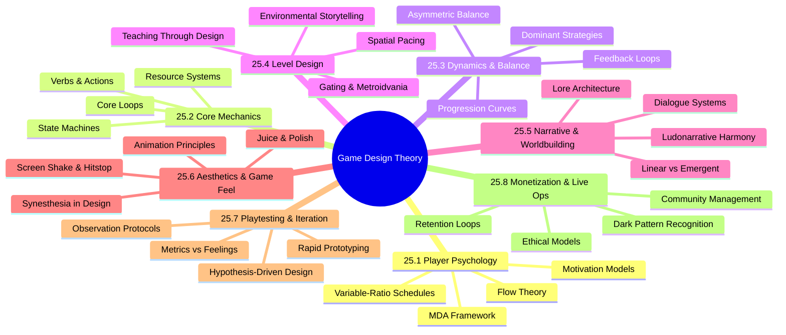

*Back to [09 - Learning Index](09---Learning-Index)*

# Track 25 — Game Design Theory: Subject Plan

> *"A game is a series of interesting decisions."*
> — **Sid Meier**

---

## 🗺️ Curriculum Mindmap

---

## 📚 Chapter Index

| # | Chapter | Core Question | Key Thinkers |
|---|---------|--------------|--------------|
| 25.1 | [25.1 - Player Psychology & Motivation - The MDA Framework](25.1---Player-Psychology-&-Motivation---The-MDA-Framework) | Why do players play? What makes a game "fun"? | Hunicke, Koster, Csikszentmihalyi |
| 25.2 | [25.2 - Core Mechanics & Systems Design](25.2---Core-Mechanics-&-Systems-Design) | What are the atomic building blocks of gameplay? | Schell, Cook, Dormans |
| 25.3 | [25.3 - Dynamics, Balance & Feedback Loops](25.3---Dynamics,-Balance-&-Feedback-Loops) | How do mechanics interact to create emergent behavior? | Sirlin, Salen & Zimmerman |
| 25.4 | [25.4 - Level Design & Spatial Pacing](25.4---Level-Design-&-Spatial-Pacing) | How does space teach, challenge, and reward? | Totten, Nintendo EAD |
| 25.5 | [25.5 - Narrative & Worldbuilding](25.5---Narrative-&-Worldbuilding) | How do story and gameplay reinforce each other? | Adams, Bartle, Jenkins |
| 25.6 | [25.6 - Aesthetics, Juice & Game Feel](25.6---Aesthetics,-Juice-&-Game-Feel) | What makes a game *feel* good moment-to-moment? | Swink, Jonasson & Purho |
| 25.7 | [25.7 - Playtesting & Iteration](25.7---Playtesting-&-Iteration) | How do you validate design decisions with real players? | Fullerton, Schell |
| 25.8 | [25.8 - Monetization & Live Ops](25.8---Monetization-&-Live-Ops) | How do you sustain a game ethically post-launch? | Various, Sirlin |

---

## 🎓 Free Learning Resources (Premium-Free Catalog)

### 📖 Books (Free/Open Access)
- **Jesse Schell** — *The Art of Game Design: A Book of Lenses* (3rd ed.) — the definitive design textbook
- **Raph Koster** — *A Theory of Fun for Game Design* (2nd ed.) — why brains enjoy games
- **David Sirlin** — *Playing to Win* (free at sirlin.net) — competitive balance philosophy
- **Tracy Fullerton** — *Game Design Workshop* — hands-on prototyping methodology
- **Anna Anthropy & Naomi Clark** — *A Game Design Vocabulary* — mechanics-first thinking

### 🎬 Video (YouTube / Free)
- **Game Maker's Toolkit (Mark Brown)** — best-in-class design analysis (400+ videos)
- **Extra Credits** — accessible game design theory series
- **Jonas Tyroller** — indie dev design diaries and breakdowns
- **GDC Vault (Free Talks)** — professional postmortems and design deep-dives
- **Adam Millard (The Architect of Games)** — systems design analysis
- **Masahiro Sakurai on Creating Games** — 200+ short design lessons from the Smash Bros creator

### 🌐 Written (Web)
- **Sirlin.net** — balance, competitive design, yomi layers
- **Gamasutra/Game Developer** — professional articles and postmortems
- **Lost Garden (Daniel Cook)** — systems design essays
- **Red Blob Games** — interactive visual explanations of game algorithms

### 🎓 Courses (Free)
- **MIT OCW 11.127** — *Game Design and Development* (lecture notes)
- **Coursera: Game Design Specialization** (CalArts, audit free)

---

## 🔗 Parallel Tracks

This track is **theory-focused**. For implementation:
- [Track 04 Game_Dev](Track-04-Game_Dev) — Engineering: code architecture, ECS, networking, optimization
- [Track 09 VR & 3D](Track-09-VR-&-3D) — Engines: Unity/Unreal/Godot, 3D math, shaders, spatial audio

For the science underneath player behavior:
- [05 - Neuroscience & Computational Cognition](05---Neuroscience-&-Computational-Cognition) — How brains process reward, attention, learning
- [06 - Behavioral Psychology & Reinforcement Learning](06---Behavioral-Psychology-&-Reinforcement-Learning) — Conditioning, dopamine RPE, habit formation

---

## 📊 Progress Tracker

| Chapter | Status | Date Started | Date Completed |
|---------|--------|-------------|----------------|
| 25.1 | 🟡 Ready | — | — |
| 25.2 | 🟡 Ready | — | — |
| 25.3 | 🟡 Ready | — | — |
| 25.4 | 🟡 Ready | — | — |
| 25.5 | 🟡 Ready | — | — |
| 25.6 | 🟡 Ready | — | — |
| 25.7 | 🟡 Ready | — | — |
| 25.8 | 🟡 Ready | — | — |

---

*Last updated: 2026-05-24*

---

## Related Notes
