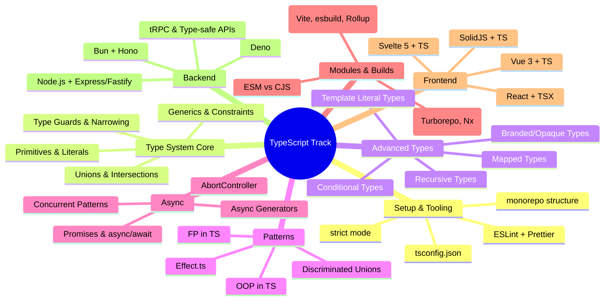

*Back to [09 - Learning Index](09---Learning-Index)*

# 🗺️ TypeScript — Subject Plan

> *"TypeScript is JavaScript that scales."* — **Anders Hejlsberg**, creator of TypeScript

---

## 🎯 Track Mission

Take your existing Python fluency and rusty JS knowledge and transform them into production-grade TypeScript skills. This track targets the **intersection of what employers want** (React/Next.js, Node/Bun backends, type-safe APIs) and **what makes you dangerous** (understanding type theory well enough to read any codebase cold).

**End state:** You can pass a TypeScript technical interview, contribute to typed codebases on day one, and architect full-stack TS applications.

---

## 🧠 Mindmap — Track Architecture

---

## 📚 Chapter Index

| # | Chapter | Focus | Time |
|---|---------|-------|------|
| 13.1 | [13.1 - Setup, Compilation & Project Structure](13.1---Setup,-Compilation-&-Project-Structure) | tsconfig, strict mode, monorepos, toolchain | 4–5 hrs |
| 13.2 | [13.2 - Type System - Primitives, Unions, Intersections, Generics](13.2---Type-System---Primitives,-Unions,-Intersections,-Generics) | Core type system, generics, narrowing | 8–10 hrs |
| 13.3 | [13.3 - Advanced Types - Conditional, Mapped, Template Literal Types](13.3---Advanced-Types---Conditional,-Mapped,-Template-Literal-Types) | Type-level programming, infer, branded types | 10–12 hrs |
| 13.4 | [13.4 - OOP & FP Patterns in TypeScript](13.4---OOP-&-FP-Patterns-in-TypeScript) | Classes, interfaces, FP composition, Effect.ts | 8–10 hrs |
| 13.5 | [13.5 - Async, Promises & Async Generators](13.5---Async,-Promises-&-Async-Generators) | Concurrency, error handling, streaming | 6–8 hrs |
| 13.6 | [13.6 - Modules & Build Systems](13.6---Modules-&-Build-Systems) | ESM/CJS, bundlers, monorepo architecture | 5–6 hrs |
| 13.7 | [13.7 - Frontend with TypeScript - React, Vue, Svelte, SolidJS](13.7---Frontend-with-TypeScript---React,-Vue,-Svelte,-SolidJS) | Typed components, hooks, framework patterns | 10–12 hrs |
| 13.8 | [13.8 - Backend with TypeScript - Node, Bun, Deno, Express, Fastify, Hono](13.8---Backend-with-TypeScript---Node,-Bun,-Deno,-Express,-Fastify,-Hono) | Server frameworks, type-safe APIs, deployment | 10–12 hrs |
| — | [TypeScript Essentials for Coding Tests](TypeScript-Essentials-for-Coding-Tests) | *Reference appendix* — interview patterns & algorithms | As needed |

**Total estimated time:** 60–75 hours (~6–8 weeks at 2 hrs/day)

---

## 📖 Resources (Premium-Free)

### Primary References
| Resource | Type | Cost | Notes |
|----------|------|------|-------|
| [TypeScript Handbook](https://www.typescriptlang.org/docs/handbook/) | Official docs | Free | The canonical reference. Read cover to cover. |
| [Total TypeScript — Beginners](https://www.totaltypescript.com/tutorials/beginners-typescript) | Video course | Free | Matt Pocock's intro. Best teacher in the TS space. |
| [Total TypeScript — Type Transformations](https://www.totaltypescript.com/tutorials/type-transformations) | Video course | Free | Mapped types, conditional types, infer. |
| [Type-Level TypeScript](https://type-level-typescript.com/) | Interactive | Free tier | Type challenges with instant feedback. |
| [TypeScript Playground](https://www.typescriptlang.org/play) | Tool | Free | Live compiler with hover types. Use daily. |

### Supplementary
| Resource | Type | Notes |
|----------|------|-------|
| [type-challenges](https://github.com/type-challenges/type-challenges) | GitHub repo | 170+ type puzzles, easy→extreme. |
| [type-fest](https://github.com/sindresorhus/type-fest) | Library | Collection of essential utility types. Study the source. |
| [Effect.ts](https://effect.website/) | Library/Framework | Advanced FP patterns. Chapter 13.4 deep-dive. |
| [Theo (t3.gg)](https://www.youtube.com/@t3dotgg) | YouTube | Full-stack TS opinions, T3 stack (Next + tRPC + Prisma). |
| [Matt Pocock's Blog](https://www.mattpocock.com/) | Blog | Weekly TS tips, type gymnastics. |
| [TypeScript Deep Dive](https://basarat.gitbook.io/typescript/) | Free book | Older but solid fundamentals. |

---

## 🔗 Cross-Track Links

- **Python OOP comparison:** [08.3 - OOP, Data Models & Pythonic Idioms](08.3---OOP,-Data-Models-&-Pythonic-Idioms) — structural typing in TS ≈ Python protocols
- **React/Next.js:** [22.1 - React & Next.js - Functional Components & Hooks](22.1---React-&-Next.js---Functional-Components-&-Hooks) — Chapter 13.7 builds on this
- **Angular:** [22.2 - Angular - Class-based Architecture & RxJS](22.2---Angular---Class-based-Architecture-&-RxJS) — heavy TS usage, decorators
- **JavaScript refresher:** [Track 05 JavaScript](Track-05-JavaScript) — prerequisite if rusty

---

## 🏗️ Practice Infrastructure

All practice scripts live in `_practice/scripts/`:
- Python harness scripts generate drill problems (same pattern as math tracks)
- TypeScript source files for hands-on compilation exercises
- Run with `bun` or `tsc` + `node`

---

## 📅 Suggested Schedule

| Week | Chapters | Milestone |
|------|----------|-----------|
| 1 | 13.1 + 13.2 (first half) | Can configure a TS project, understand basic types |
| 2 | 13.2 (second half) + 13.3 (first half) | Generics fluent, starting advanced types |
| 3 | 13.3 (complete) | Can write conditional/mapped types from scratch |
| 4 | 13.4 + 13.5 | OOP/FP patterns, async mastery |
| 5 | 13.6 + 13.7 (first half) | Module systems, starting React+TS |
| 6 | 13.7 (complete) + 13.8 (first half) | Frontend frameworks typed, starting backend |
| 7 | 13.8 (complete) | Full-stack TS capable |
| 8 | Review + [TypeScript Essentials for Coding Tests](TypeScript-Essentials-for-Coding-Tests) | Interview-ready |

---

*Last updated: 2026-05-24*

---

## Related Notes
- [LEARNING_PATH](LEARNING_PATH) - Shared typescript/career focus
