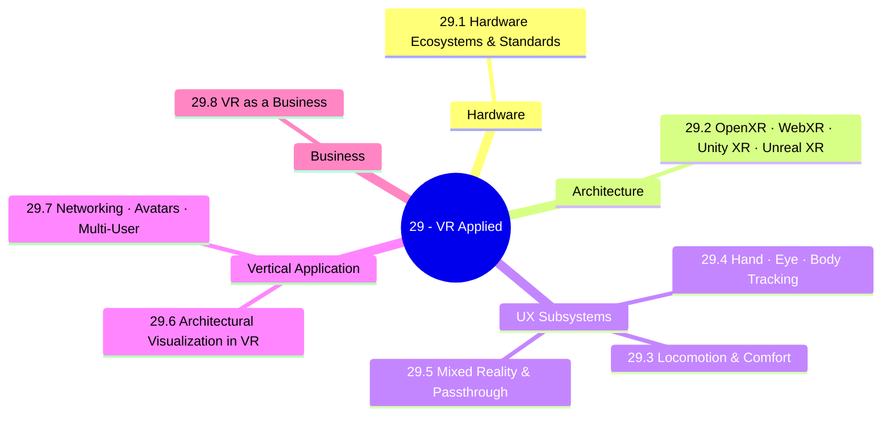

*Back to [00 - 09 - Learning Index](00---09---Learning-Index) | Part of [LEARNING_PATH](LEARNING_PATH)*

# 🥽 VR — Subject Plan (Applied / Business)

> *"In 2026, virtual reality development is no longer synonymous with just 'gaming.' It is the architectural foundation of Spatial Computing. We have entered a 'stabilized era' where software ecosystems have finally caught up with hardware capabilities."*
> — paraphrased from [framesixty — Virtual Reality Development Guide 2026](https://framesixty.com/virtual-reality-development-guide/) (rephrased for compliance)

---

## 🎯 Mission Statement

This track is the **applied / business** capstone of the 20→21→22→23→24 chain. It deliberately does **not** duplicate [Track 28 - VR & 3D Engineering](Subject_Plan) (which is the math + rendering + engine foundations). Instead, this track answers: **given that you can render in 3D, given that you've modelled in Revit / Blender, given that you know holographics — how do you build, ship, and sell VR products in 2026?**

The 2026 VR landscape (May 2026):
- Apple Vision Pro 2 (M5 chip, $3,499) — premium spatial computing.
- Meta Quest 3 ($499) and Quest 3S ($299) — mass-market.
- Valve Index 2 / Pico 5 / HTC Vive Focus Vision — niche / enterprise.
- **OpenXR is the standard runtime** across all major headsets.
- Hand tracking is sub-20 ms; eye tracking is mainstream; body tracking is broadly available.
- Mixed-reality passthrough is now table-stakes.
- Foundation models are arriving in spatial computing (multimodal LLMs as VR avatars, scene understanding via VLMs).

The eight chapters take you from **understanding the hardware ecosystem** through **building cross-platform OpenXR apps** to **specific subsystems** (locomotion, tracking, MR, networking) to the **architectural-visualization vertical** that maps directly to your background, ending with the **VR business chapter**.

---

## 📊 Track Overview



---

## 📚 Chapter Inventory

| # | Chapter | Domain | Status |
|---|---------|--------|--------|
| 29.1 | VR Hardware Ecosystems & Standards — Quest, Vision Pro, Index, Pico, Vive | Hardware survey | 🟡 Skeleton |
| 29.2 | Immersive App Architectures — OpenXR, WebXR, Unity XR, Unreal XR, RealityKit | Cross-platform architecture | 🟡 Skeleton |
| 29.3 | Locomotion & Comfort Design | UX | 🟡 Skeleton |
| 29.4 | Hand, Eye & Body Tracking — Inputs Beyond Controllers | Input | 🟡 Skeleton |
| 29.5 | Mixed Reality & Passthrough Pipelines | Spatial computing | 🟡 Skeleton |
| 29.6 | Architectural Visualization in VR — Revit / IFC / USD → Quest / Vision Pro | Vertical (your lane) | 🟡 Skeleton |
| 29.7 | Networking, Avatars & Multi-User Spaces | Social / collaborative | 🟡 Skeleton |
| 29.8 | VR as a Business — Productization, Distribution, Monetization | Capstone | 🟡 Skeleton |

---

## 🔗 Prerequisites

| Prerequisite | Where You Learned It | Why It Matters |
|---|---|---|
| **VR & 3D Engineering foundations** | [Subject_Plan](Subject_Plan) | Math, shaders, engine architectures |
| 3D modelling / DCC | [Subject_Plan](Subject_Plan) | Revit / Blender → VR pipelines |
| Holographics literacy | [Subject_Plan](Subject_Plan) | Light-field & holographic siblings of VR |
| C# (Unity) | [Subject_Plan](Subject_Plan) | Quest dev path |
| C++ / Unreal | [Subject_Plan](Subject_Plan) | High-end Unreal XR |
| TypeScript | [Subject_Plan](Subject_Plan) | WebXR + three.js / @react-three/xr |
| App architectures | [Subject_Plan](Subject_Plan) | React / Flutter side of mixed apps |
| Networking / DDS | [22.5 - ROS 2 & Middleware - Nodes, Topics, Services, Actions, DDS](22.5---ROS-2-&-Middleware---Nodes,-Topics,-Services,-Actions,-DDS) | Multi-user VR networking parallels |

---

## 🆓 Premium-Free Resource Catalog

> Pictures, videos, and reference materials live **outside the repo** (Apple / Meta developer docs, YouTube, GitHub). SVG diagrams that we author live inside `../_svgs/` with the `vrapp__<ch>-fig<n>.svg` prefix.

### 🎓 Primary Lecture & Course Series

| Resource | Provider | Coverage | Link |
|---|---|---|---|
| **Meta Horizon / Quest Developer Documentation** | Meta | The de-facto VR dev docs (Unity, Unreal, OpenXR, Web) | [developers.meta.com/horizon](https://developers.meta.com/horizon/) |
| **Apple Vision Pro / visionOS docs** | Apple | RealityKit + ARKit + SwiftUI for spatial computing | [developer.apple.com/visionos](https://developer.apple.com/visionos/) |
| **Khronos OpenXR specification + samples** | Khronos | The cross-vendor standard | [khronos.org/openxr](https://www.khronos.org/openxr/) |
| **Unity XR Toolkit (XRI) docs** | Unity | Unity-side OpenXR wrapper + interactions | [docs.unity3d.com/Packages/com.unity.xr.interaction.toolkit](https://docs.unity3d.com/Packages/com.unity.xr.interaction.toolkit@latest/) |
| **Unreal Engine OpenXR / VR docs** | Epic | Unreal-side XR | [docs.unrealengine.com](https://docs.unrealengine.com/) |
| **WebXR Device API (W3C)** | W3C | Browser-native XR | [immersive-web.github.io](https://immersive-web.github.io/webxr/) |
| **A-Frame / @react-three/xr** | Open source | Practical WebXR frameworks | [aframe.io](https://aframe.io/), [github.com/pmndrs/react-three-xr](https://github.com/pmndrs/react-three-xr) |
| **GameDev.tv VR courses** | Online | Beginner-friendly VR dev | [gamedev.tv](https://www.gamedev.tv/) |
| **Valem Tutorials (YouTube)** | Community | Quest + Unity VR | [@ValemTutorials](https://www.youtube.com/@ValemTutorials) |
| **Justin P Barnett (YouTube)** | Community | Practical Unity XR Toolkit | [@JustinPBarnett](https://www.youtube.com/@JustinPBarnett) |
| **The OpenXR YouTube channel** | Khronos | Talks + samples | [Khronos YouTube playlist](https://www.youtube.com/c/Khronos_Group) |

### 📖 Open-Source / Free Books & Specs

| Resource | Author / Provider | Coverage |
|---|---|---|
| **OpenXR 1.1 Specification** | Khronos | Authoritative — [khronos.org/openxr](https://www.khronos.org/openxr/) |
| **WebXR Device API Specification** | W3C | [immersive-web.github.io/webxr](https://immersive-web.github.io/webxr/) |
| **Meta OpenXR SDK (19 native C/C++ samples)** | Meta | [github.com/meta-quest/Meta-OpenXR-SDK](https://github.com/meta-quest/Meta-OpenXR-SDK) |
| **Apple visionOS sample code + Reality Composer Pro docs** | Apple | [developer.apple.com/visionos](https://developer.apple.com/visionos/) |
| **OculusVR / Meta SDK on GitHub** | Meta | Various open repos under [github.com/meta-quest](https://github.com/meta-quest) |
| **WebXR samples** | W3C / Immersive Web Community Group | [immersive-web.github.io/webxr-samples](https://immersive-web.github.io/webxr-samples/) |
| **A-Frame docs + examples** | Open source | [aframe.io/docs](https://aframe.io/docs/) |
| **OVR Toolkit / SteamVR docs** | Valve | Open + community references |

### 🛠️ Free / Indie Tooling

- **Unity 6 LTS** — current Unity LTS for XR.
- **Unreal Engine 5.5/5.6** — current UE for XR.
- **OpenXR runtimes**: Meta, SteamVR, Microsoft Mixed Reality, Monado (open-source).
- **Reality Composer Pro** — author USD scenes for Vision Pro.
- **ShapesXR** — collaborative spatial design (used widely in arch-viz).
- **Mozilla Hubs / Spatial.io** — cross-platform multi-user spaces.
- **VRChat SDK** — non-trivial but useful for social-VR experimentation.
- **Resonite** — Unity-based open social VR platform.
- **Foxglove / rerun.io** — multi-modal logging (also useful for VR debugging).
- **Three.js + @react-three/xr / @react-three/fiber** — WebXR with React.

---

## 🏗️ Study Strategy

### Phase 1: Hardware + Architecture (Chapters 24.1–29.2) — 3 weeks
Survey the 2026 device matrix; build "hello world" in OpenXR + Unity XR Toolkit + WebXR + RealityKit. By the end of this phase you can deploy the same scene to Quest, Vision Pro, and a browser.

### Phase 2: UX Subsystems (Chapters 24.3–29.5) — 4 weeks
Locomotion + comfort, then hand / eye / body tracking, then mixed reality + passthrough. Each chapter has a paired exercise on Quest 3 or Vision Pro.

### Phase 3: Vertical + Multi-User (Chapters 24.6–29.7) — 3 weeks
Arch-viz pipeline (Revit → IFC → USD → Quest / Vision Pro), then networking + avatars. Outcome: a multi-user walk-through of an arch model.

### Phase 4: Business (Chapter 29.8) — 2 weeks
Productization, distribution, monetization, integration with the 20.8 / 23.7 / 23.8 business chapters.

---

## 📁 Directory Structure

```
29 - VR/
├── Subject_Plan.md          ← You are here
├── LEARNING_PATH.md
├── README.md
├── 29.1 - VR Hardware Ecosystems & Standards.md
├── 29.2 - Immersive App Architectures - OpenXR, WebXR, Unity XR, Unreal XR.md
├── 29.3 - Locomotion & Comfort Design.md
├── 29.4 - Hand, Eye & Body Tracking - Inputs Beyond Controllers.md
├── 29.5 - Mixed Reality & Passthrough Pipelines.md
├── 29.6 - Architectural Visualization in VR - Revit, IFC, USD to Quest & Vision Pro.md
├── 29.7 - Networking, Avatars & Multi-User Spaces.md
├── 29.8 - VR as a Business - Productization, Distribution, Monetization.md
└── _practice/
    └── scripts/
```

SVG figures live one level up in `../_svgs/vrapp__<chapter>-fig<n>.svg`.

---

*Next: [LEARNING_PATH](LEARNING_PATH) — Visual progression map*

---

## Related Notes
- [29.1 - VR Hardware Ecosystems & Standards](29.1---VR-Hardware-Ecosystems-&-Standards) - Shared vision-pro/openxr focus
- [29.2 - Immersive App Architectures - OpenXR, WebXR, Unity XR, Unreal XR](29.2---Immersive-App-Architectures---OpenXR,-WebXR,-Unity-XR,-Unreal-XR) - Shared openxr/webxr focus
- [29.5 - Mixed Reality & Passthrough Pipelines](29.5---Mixed-Reality-&-Passthrough-Pipelines) - Shared mixed-reality/passthrough focus
- [29.6 - Architectural Visualization in VR - Revit, IFC, USD to Quest & Vision Pro](29.6---Architectural-Visualization-in-VR---Revit,-IFC,-USD-to-Quest-&-Vision-Pro) - Shared vision-pro/business focus
- [LEARNING_PATH](LEARNING_PATH) - Shared vision-pro/archviz focus
